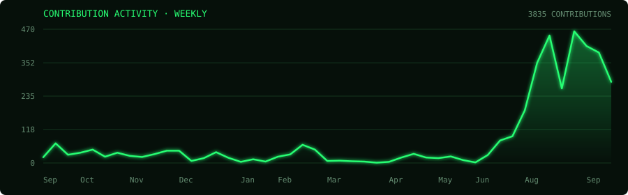

  

  

  
  
  
  

## `$ whoami`

  

> `> There is no spoon. There is only the right data structure.`

Years of competitive programming shaped my instinct for optimal architecture, heuristics and data
structures. At **Goldis** I build concurrent worker systems that keep thousands of products in sync
across marketplaces, and millisecond-precise automated gold trading engines. Custom ORM to squeeze
I/O? Enterprise wrapper around FastAPI? The job decides the tool — and if it does not exist, I write it.

## `$ cat /proc/pouya/projects`

<table>
  <tr>
    <td width="50%" valign="top">
      <h3>&#9889; fastamu</h3>
      
Batteries-included framework extending <b>FastAPI</b> for enterprise architecture — Taskiq,
      Dishka and msgspec wired in. Opinionated, fast, allergic to boilerplate.

      
  

    </td>
    <td width="50%" valign="top">
      <h3>&#128260; Multi-Platform Sync Engine</h3>
      
~<b>12 active workers</b> synchronising inventory, orders and multi-strategy pricing across
      <b>Digikala</b>, <b>Snapp</b>, <b>Basalam</b> and <b>Tapsi</b>.

      
  

    </td>
  </tr>
  <tr>
    <td width="50%" valign="top">
      <h3>&#129351; Digital Gold Trading — Talamala</h3>
      
Real-time automated trading on a <b>RabbitMQ</b> + <b>Redis</b> queue-worker architecture.
      Instant execution, market-fluctuation risk engineered away.

      
 

    </td>
    <td width="50%" valign="top">
      <h3>&#127918; Low-Level Explorations</h3>
      
2D game renderers in <b>C</b> with <b>SDL2</b>, <b>Rust</b> for systems work, and
      <b>Assembly (FASM)</b> — abstractions are better understood from below.

      
  

    </td>
  </tr>
</table>

## `$ ls -la /usr/lib/arsenal`

`languages/`

`frameworks/`

`infrastructure/`

## `$ ./stats --live --tail`

  
  

  

  

### `$ ./contributions --activity`

  

### `$ ./contributions --snake`

  <picture>
    <source media="(prefers-color-scheme: dark)" srcset="https://raw.githubusercontent.com/stupidprogrammer4/stupidprogrammer4/output/github-contribution-grid-snake-dark.svg" />
    
  </picture>

## `$ history | grep contest`

| arena | track | score |
|:---|:---|:---:|
| **Technology Olympics 2024** | Algorithm | `4.5` |
| **Algorithm Technology — Quera** | Algorithm | `8.9` |
| **Hamkad 5** | Software Engineering | `—` |

> `> Competitive programming did not teach me to write code fast.` 
> `> It taught me which code not to write at all.`

## `$ cat ~/.config/off-keyboard`

  
<b>&#129354; combat/</b>

   
  <ul>
    <li><b>Boxing</b> — footwork is just pathfinding with consequences.</li>
    <li><b>Calisthenics</b> — bodyweight only. No dependencies, zero install.</li>
  </ul>

  
<b>&#129504; algorithms/</b>

   
  <ul>
    <li>Tree Dynamic Programming</li>
    <li>Computational Geometry</li>
    <li>Heuristics &amp; approximation for problems that refuse to be polynomial</li>
  </ul>

  
<b>&#129419; aesthetics/</b>

   
  
Butterflies, phosphor green on black, terminals with too much transparency,
  and a tiling window manager configured well past the point of reason.

## `$ ssh pouya@matrix`

  
  
  
  
  

 

  <table>
    <tr>
      <td align="center"><b>&#128308; RED PILL</b> Talk concurrency, weird ORMs, and why your loop should have been a heap.</td>
      <td align="center"><b>&#128309; BLUE PILL</b> Close the tab. The README ends, the story ends.</td>
    </tr>
  </table>

  <code>connection terminated &#183; wake up, Neo &#183; 🦋</code>

