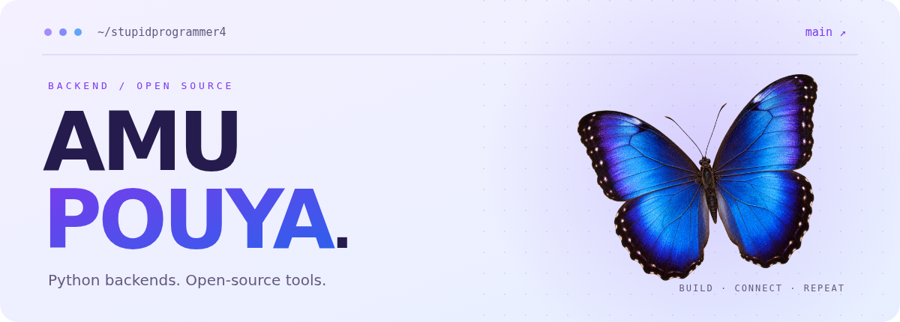
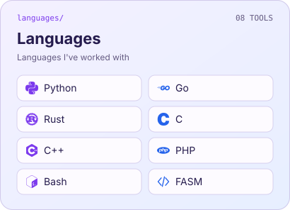
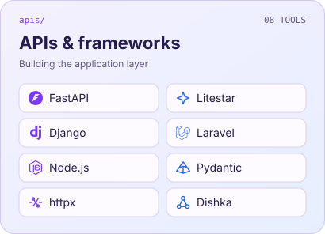
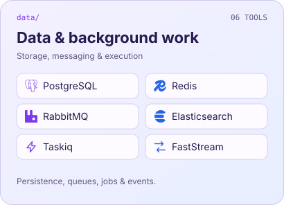
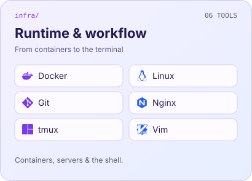
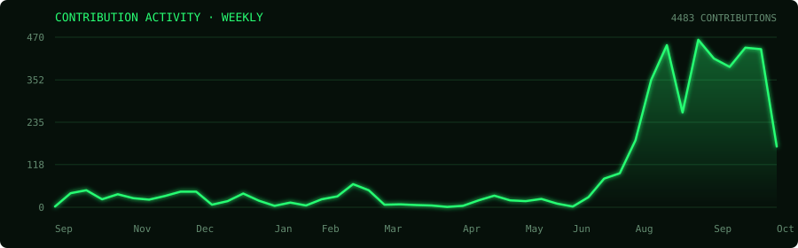

<div align="center">
  <a href="https://amupouya.org/">
    <picture>
      <source media="(prefers-color-scheme: dark)" srcset="assets/profile-header-dark.png">
      
    </picture>
  </a>
</div>

<div align="center">
  <a href="https://github.com/stupidprogrammer4">
    
  </a>
</div>

<div align="center">
  
  <a href="https://github.com/stupidprogrammer4?tab=followers"></a>
  
  
</div>


## `$ whoami`

```python
name = "Pouya Sadeghi"
alias = "Amu Pouya Parvaneh"
role = "Backend Dev / System Architect"
org = "Goldis"
education = "BSc Computer Science"
study = "2023–2027"
os = "Arch Linux (btw)"
shell = ("bash", "tmux", "vim")
focus = ("low-latency", "concurrency")
off_keyboard = ("boxing", "calisthenics")
```

<details>
  <summary><b>🦋 Open the original ASCII identity terminal</b></summary>
  <br>
  <div align="center">
    
  </div>
</details>

> `> There is no spoon. There is only the right data structure.`

**Pouya Sadeghi · Amu Pouya Parvaneh** — backend developer, competitive programmer, and the person who will probably write a library for that.

Years of competitive programming shaped my instinct for optimal architecture, heuristics and data
structures. At **Goldis** I build concurrent worker systems that keep thousands of products in sync
across marketplaces, alongside automated gold trading systems built around queues and workers. Custom ORM to squeeze
I/O? Enterprise wrapper around FastAPI? The job decides the tool — and if it does not exist, I write it.

I care about typed integration boundaries, explicit async lifetimes, and choosing data structures for the actual workload. That is where the contest habits meet production systems.


## `$ cat /proc/pouya/projects`

<table>
  <tr>
    <td width="50%" valign="top">
      <h3>🦋 <a href="https://github.com/stupidprogrammer4/papilio">Papilio</a></h3>
      <p>A modular foundation for Python APIs, evolved from Fastamu. Module discovery, dependency injection, repositories, and transactions — less wiring, more application code.</p>
      <p><code>FastAPI</code> <code>Dishka</code> <code>SQLAlchemy</code></p>
      <a href="https://github.com/stupidprogrammer4/papilio/stargazers"></a>
    </td>
    <td width="50%" valign="top">
      <h3>⚡ <a href="https://github.com/stupidprogrammer4/papilio-tasks">Papilio Tasks</a></h3>
      <p>Background jobs, scheduling, and projections. Typed event publishers and subscribers, with the infrastructure you choose.</p>
      <p><code>Taskiq</code> <code>FastStream</code> <code>Dishka</code></p>
      <a href="https://github.com/stupidprogrammer4/papilio-tasks/stargazers"></a>
    </td>
  </tr>
  <tr>
    <td width="50%" valign="top">
      <h3>🔎 <a href="https://github.com/stupidprogrammer4/digikala-mcp">Digikala MCP</a></h3>
      <p>An MCP server for product discovery, research, and offer comparison. Cart operations with an execution journal.</p>
      <p><code>FastMCP</code> <code>Pydantic</code> <code>httpx</code></p>
      <a href="https://github.com/stupidprogrammer4/digikala-mcp/stargazers"></a>
    </td>
    <td width="50%" valign="top">
      <h3>🔗 <a href="https://github.com/stupidprogrammer4/iranian-marketplaces-sdk">Marketplace SDK</a></h3>
      <p>Typed Python clients for Digikala, Snapp Shop, Basalam, and Tapsi Shop. One consistent interface, sync or async.</p>
      <p><code>Python</code> <code>Pydantic</code> <code>httpx</code></p>
      <a href="https://github.com/stupidprogrammer4/iranian-marketplaces-sdk/stargazers"></a>
    </td>
  </tr>
  <tr>
    <td width="50%" valign="top">
      <h3>🔄 Multi-Platform Sync Engine</h3>
      <p>Concurrent workers synchronising inventory, orders, and multi-strategy pricing across <b>Digikala</b>, <b>Snapp Shop</b>, <b>Basalam</b>, and <b>Tapsi Shop</b>.</p>
      <p><code>Concurrency</code> <code>PostgreSQL</code> <code>Redis</code></p>
    </td>
    <td width="50%" valign="top">
      <h3>🥇 Digital Gold Trading — Talamala</h3>
      <p>Automated gold trading on a <b>RabbitMQ</b> + <b>Redis</b> queue-worker architecture. Background execution, coordination, and real-time workflows.</p>
      <p><code>RabbitMQ</code> <code>Redis</code> <code>Workers</code></p>
    </td>
  </tr>
  <tr>
    <td width="50%" valign="top">
      <h3>🎮 Low-Level Explorations</h3>
      <p>2D game renderers in <b>C</b> with <b>SDL2</b>, <b>Rust</b> for systems work, and <b>Assembly (FASM)</b> — abstractions are better understood from below.</p>
      <p><code>C</code> <code>SDL2</code> <code>Rust</code> <code>FASM</code></p>
    </td>
    <td width="50%" valign="top">
      <h3>🔀 Open-source Contributions</h3>
      <p><a href="https://github.com/taskiq-python/taskiq/pull/672"><b>Taskiq #672</b></a> — merged scheduler cleanup for startup failures and cancellation. Close started sources, preserve the original exception, and test the failure paths.</p>
      <p><code>Async Python</code> <code>Taskiq</code> <code>pytest</code></p>
    </td>
  </tr>
</table>


## `$ ls -la /usr/lib/arsenal`

<div align="center">
  <picture>
    <source media="(prefers-color-scheme: dark)" srcset="assets/toolkit/languages-dark.svg">
    
  </picture>
  <picture>
    <source media="(prefers-color-scheme: dark)" srcset="assets/toolkit/apis-dark.svg">
    
  </picture>
  <br>
  <picture>
    <source media="(prefers-color-scheme: dark)" srcset="assets/toolkit/data-dark.svg">
    
  </picture>
  <picture>
    <source media="(prefers-color-scheme: dark)" srcset="assets/toolkit/infra-dark.svg">
    
  </picture>
</div>

<details>
  <summary><b>View the toolkit as text</b></summary>
  <p><b>Languages:</b> Python · Go · Rust · C · C++ · PHP · Bash · FASM</p>
  <p><b>APIs &amp; frameworks:</b> FastAPI · Litestar · Django · Laravel · Node.js · Pydantic · httpx · Dishka</p>
  <p><b>Data &amp; background work:</b> PostgreSQL · Redis · RabbitMQ · Elasticsearch · Taskiq · FastStream</p>
  <p><b>Runtime &amp; workflow:</b> Docker · Linux · Git · Nginx · tmux · Vim</p>
</details>


## `$ ./stats --live --tail`

<div align="center">
  <a href="https://github.com/stupidprogrammer4">
    
  </a>
  <a href="https://github.com/stupidprogrammer4?tab=repositories">
    
  </a>
</div>

### 🔥 Contribution streak

<div align="center">
  <a href="https://github.com/stupidprogrammer4?tab=overview">
    
  </a>
</div>

### 🏆 GitHub trophies

<div align="center">
  <a href="https://github.com/stupidprogrammer4">
    
  </a>
</div>

### `$ ./contributions --activity`

<div align="center">
  
</div>

### `$ ./contributions --snake`

<div align="center">
  <picture>
    <source media="(prefers-color-scheme: dark)" srcset="assets/contribution-snake-dark.svg" />
    
  </picture>
</div>


## `$ history | grep contest`

<div align="center">

| arena | track | score |
|:---|:---|:---:|
| **Technology Olympics 2024** | Algorithm | `4.5` |
| **Algorithm Technology — Quera** | Algorithm | `8.9` |
| **Hamkad 5** | Software Engineering | `—` |

</div>

> `> Competitive programming did not teach me to write code fast.`<br/>
> `> It taught me which code not to write at all.`


## `$ cat ~/.config/off-keyboard`

<details open>
  <summary><b>&#129354; combat/</b></summary>
  <br/>
  <ul>
    <li><b>Boxing</b> — footwork is just pathfinding with consequences.</li>
    <li><b>Calisthenics</b> — bodyweight only. No dependencies, zero install.</li>
  </ul>
</details>

<details>
  <summary><b>&#129504; algorithms/</b></summary>
  <br/>
  <ul>
    <li>Tree Dynamic Programming</li>
    <li>Computational Geometry</li>
    <li>Heuristics &amp; approximation for problems that refuse to be polynomial</li>
  </ul>
</details>

<details>
  <summary><b>&#129419; aesthetics/</b></summary>
  <br/>
  <p>Butterflies, phosphor green on black, violet and blue, terminals with too much transparency,
  and a tiling window manager configured well past the point of reason.</p>
</details>


## `$ ssh pouya@matrix`

<div align="center">
  <a href="https://amupouya.org/"></a>
  <a href="https://www.linkedin.com/in/pouya-sadeghi-5a2179250/"></a>
  <a href="mailto:ilovelinux764@gmail.com"></a>
  <a href="https://reddit.com/user/amupouya"></a>
  <a href="https://quera.org/profile/googooli"></a>
  <a href="https://github.com/stupidprogrammer4"></a>
</div>

<br/>

<div align="center">
  <table>
    <tr>
      <td align="center"><b>&#128308; RED PILL</b><br/>Talk concurrency, weird ORMs,<br/>and why your loop should have been a heap.</td>
      <td align="center"><b>&#128309; BLUE PILL</b><br/>Close the tab.<br/>The README ends, the story ends.</td>
    </tr>
  </table>
</div>


<div align="center">
  <sub><code>connection terminated &#183; wake up, Neo &#183; 🦋</code></sub>
</div>
